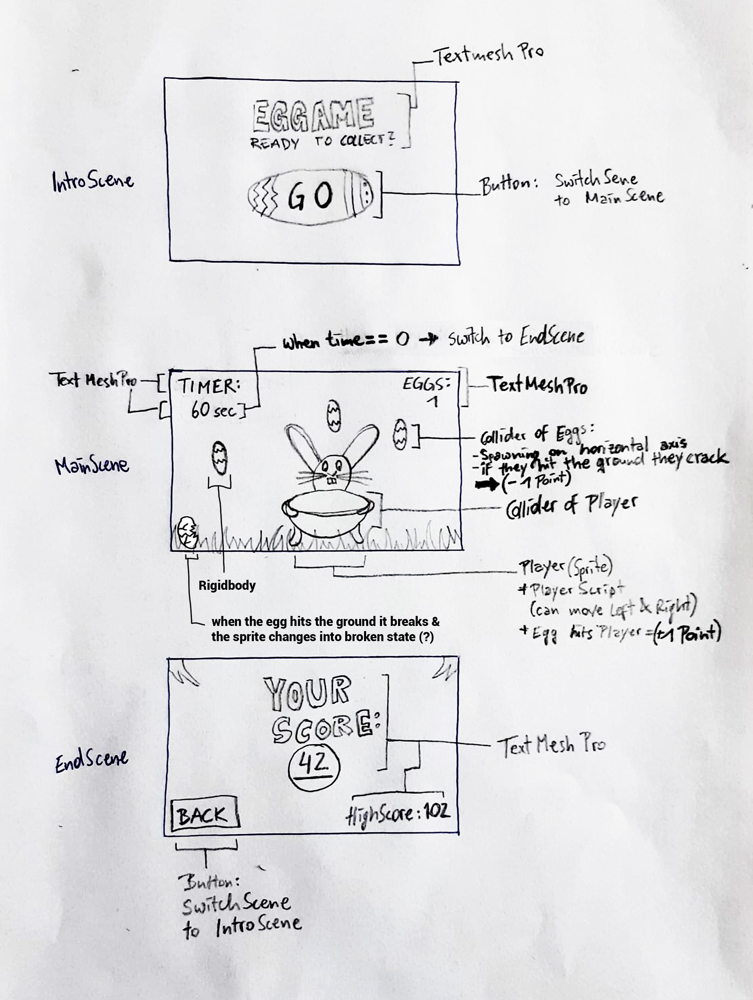

# MiniGame1-tjung

## EGGAME
**Progress:** 100% (16.06.2019)

Collect as many Eggs as possible, if they fall on the ground they break!
*So be careful.*

### Dev-Platform: 
 - *OS: macOS 10.14.4*
 - *Unity: Version 2018.2.14f1*
 - *Visual Studio: VS-Code Version 1.30.2*  
 - *Scripting Runtime Version: .NET 3.5 Equivalent*
 - *API Compatibility Level: .NET 2.0 Subset*
 
### Target-Platfrom: 
 WebGL 1024x768

### Controls: 
 On X-Axis, with AD or Left and Right.

### Concept:
(2D Game)
It's a spring/easter themed game, you play as a easter bunny. The main object of the game is to collect as many eggs as possible.
The Player can move left and right with the AD and horizontal arrow keys. 
In the game you have only a certain amount of time. If an egg hits the floor it breaks and you lose one point.
When the time is gone your score will show up in the EndScreen.

### Screens sketch

## Gameplay Screenshots
coming soon

### Lessons Learned and Limitatons
- how to use ScreenLoader Script

### Resources used:
TextMeshPro (TMP)

##### © Copyright by Thomas Junger
